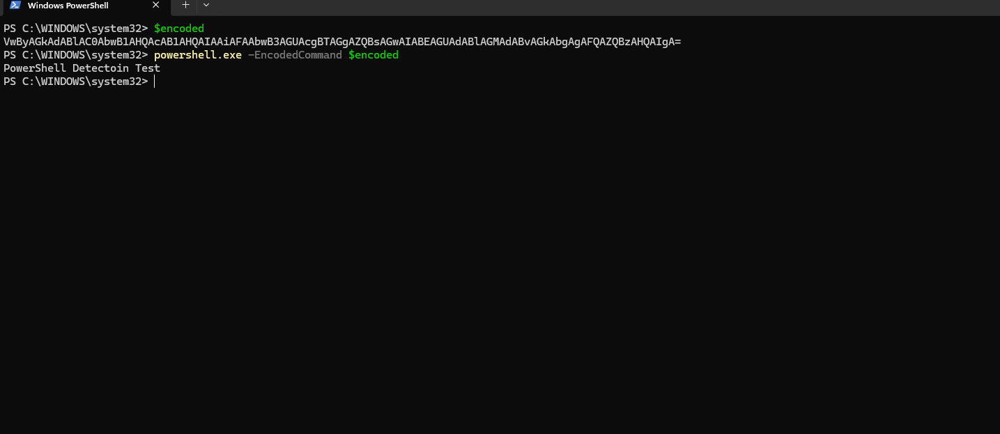
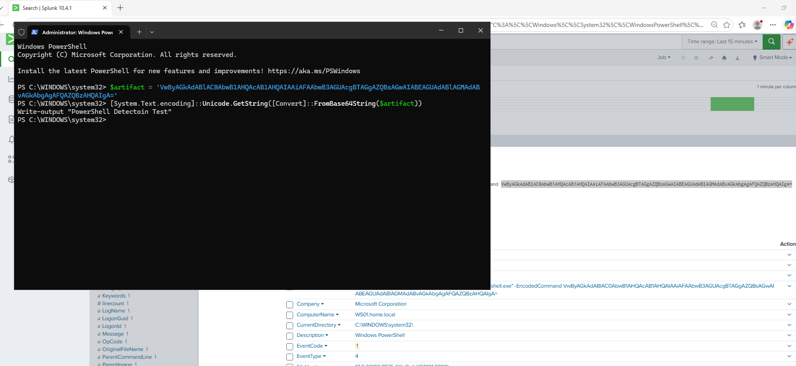
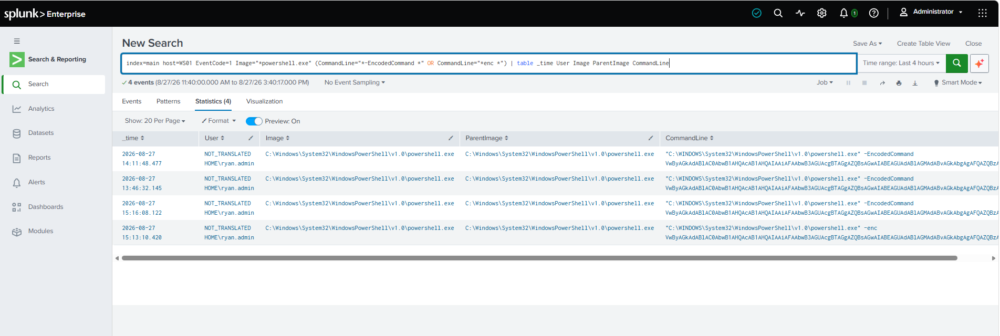
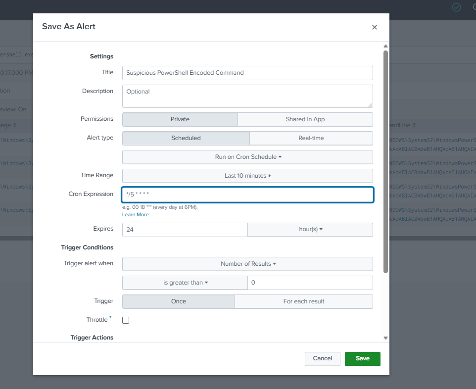
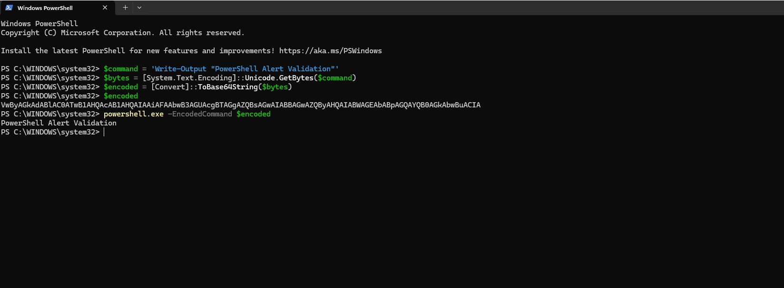
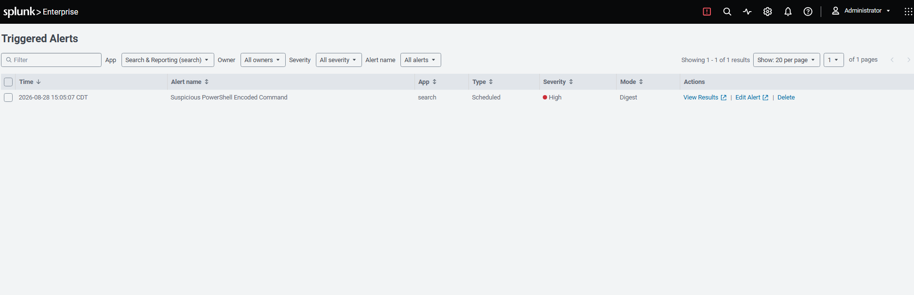
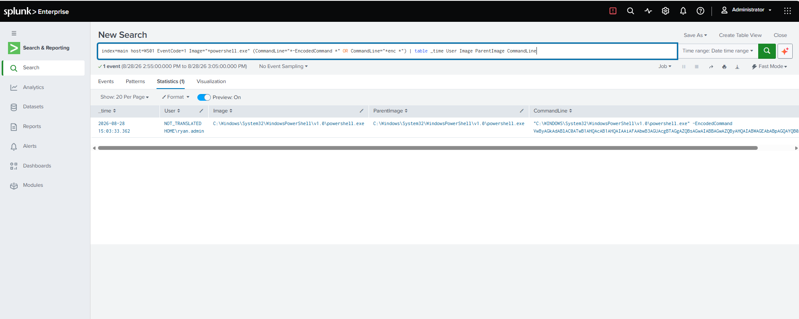

# Suspicious PowerShell Activity Detection

## Overview

This project demonstrates the detection and investigation of suspicious PowerShell activity within an Active Directory and Splunk homelab.

Using PowerShell on a monitored Windows workstation (WS01), I generated controlled encoded command activity using the `-EncodedCommand` parameter. Sysmon process creation telemetry was forwarded to Splunk, where I investigated Event ID 1 and analyzed fields including the process image, parent process, command line, and user context.

An SPL detection was developed to identify PowerShell executions containing encoded command parameters such as `-EncodedCommand` and `-enc`. The completed detection was configured as a scheduled high-severity Splunk alert and validated using fresh controlled PowerShell activity.

## Lab Environment

| System | IP Address | Role |
|---|---|---|
| DC01 | 192.168.100.10 | Domain Controller / Splunk Enterprise |
| WS01 | 192.168.100.20 | Domain-joined Windows workstation / monitored endpoint |

The environment operates on an isolated virtual network. WS01 is configured with Sysmon and the Splunk Universal Forwarder, allowing process creation telemetry to be collected and forwarded to Splunk Enterprise on DC01 for investigation and detection.

## Attack Simulation

To generate controlled suspicious PowerShell activity, an encoded PowerShell command was executed locally on WS01 using the `-EncodedCommand` parameter.

The command used a Base64-encoded PowerShell payload that produced the harmless output `PowerShell Detection Test`. This generated process creation telemetry that could later be investigated in Splunk without introducing malicious activity into the lab.

### Encoded PowerShell Execution

The encoded command executed successfully on WS01, providing the activity needed to test detection of PowerShell executions using encoded command-line arguments.

## Splunk Investigation

Following the simulated activity, Sysmon process creation telemetry from WS01 was investigated in Splunk. Sysmon Event ID 1 provided visibility into the PowerShell process and its associated command-line arguments.

Key fields examined during the investigation included:

- `Image`
- `ParentImage`
- `CommandLine`
- `User`
- `EventCode`

### Encoded PowerShell Process Creation

The Sysmon Event ID 1 event captured the PowerShell execution and exposed the `-EncodedCommand` parameter within the `CommandLine` field. This provided the primary telemetry used to identify the suspicious PowerShell behavior.

### Base64 Command Analysis

The Base64-encoded command identified in the event was extracted and decoded using PowerShell. Decoding the artifact revealed the original command:

`Write-Output "PowerShell Detection Test"`

This confirmed that the activity was the expected harmless test payload while demonstrating how encoded PowerShell commands can be investigated using command-line telemetry.

## Detection Development

After identifying the encoded PowerShell activity in Sysmon telemetry, an SPL detection was developed to identify PowerShell process creation events containing encoded command-line parameters.

The detection focuses on Sysmon Event ID 1 events generated on WS01 where `powershell.exe` appears as the process image and the command line contains indicators associated with encoded PowerShell execution.

### SPL Detection

The following SPL search was used:

    index=main host=WS01 EventCode=1 Image="*powershell.exe" (CommandLine="*-EncodedCommand *" OR CommandLine="*enc *")
    | table _time User Image ParentImage CommandLine

The search returns the event time, user, process image, parent process, and full command line, providing useful context for investigating each detected PowerShell execution.

### Detection Results

Testing the detection against existing telemetry successfully identified multiple encoded PowerShell executions on WS01, including activity using the `-EncodedCommand` parameter and its shortened form.

## Alert Configuration

The completed detection was converted into a scheduled Splunk alert named `Suspicious PowerShell Encoded Command`.

The alert was configured to:

- Run every 5 minutes
- Search the previous 10 minutes of telemetry
- Trigger when the search returns more than 0 results
- Generate a High-severity alert

## Alert Validation

After configuring the alert, fresh encoded PowerShell activity was generated on WS01 to validate the detection under controlled conditions.

A harmless command producing the output `PowerShell Alert Validation` was converted to Base64 and executed using the `-EncodedCommand` parameter.

### Validation PowerShell Execution

### Triggered Alert

The scheduled detection successfully identified the newly generated activity and produced a High-severity triggered alert in Splunk.

### Triggered Alert Investigation

The event associated with the triggered alert was reviewed in Splunk. The detection result exposed the user, PowerShell process, parent process, and encoded command line associated with the validation activity.

## Project Outcome

This project successfully demonstrated the development and validation of a Splunk detection for suspicious encoded PowerShell activity.

Sysmon Event ID 1 process creation telemetry provided visibility into PowerShell command-line activity on WS01. By analyzing the `Image`, `ParentImage`, `CommandLine`, and `User` fields, encoded PowerShell execution was identified and investigated in Splunk.

The final SPL detection identified PowerShell executions containing encoded command parameters and was converted into a scheduled High-severity alert. Fresh controlled PowerShell activity was then generated to validate that the detection and alert operated as expected.

## Skills Demonstrated

- Splunk log analysis and investigation
- SPL detection development
- Sysmon Event ID 1 process creation analysis
- PowerShell command-line analysis
- Base64 artifact decoding
- Detection testing and validation
- Scheduled Splunk alert configuration
- Endpoint telemetry analysis

## Final Project Report

A detailed project report documenting the PowerShell activity simulation, Splunk investigation, detection development, alert configuration, and validation is available below.

[View Final Project Report](Suspicious_PowerShell_Activity_Detection_Project_Report.docx.pdf)
